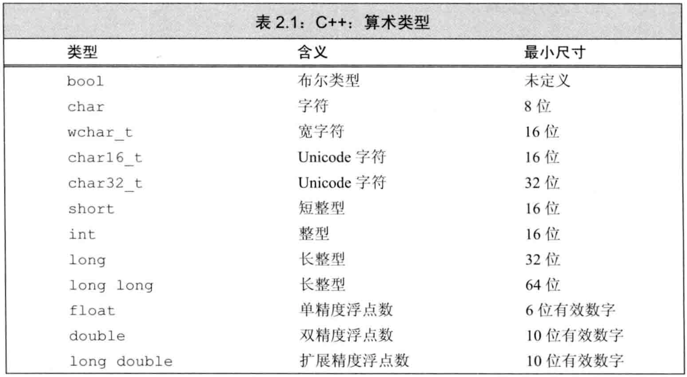
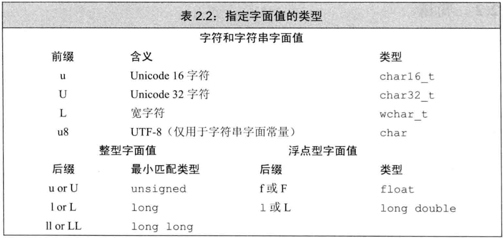
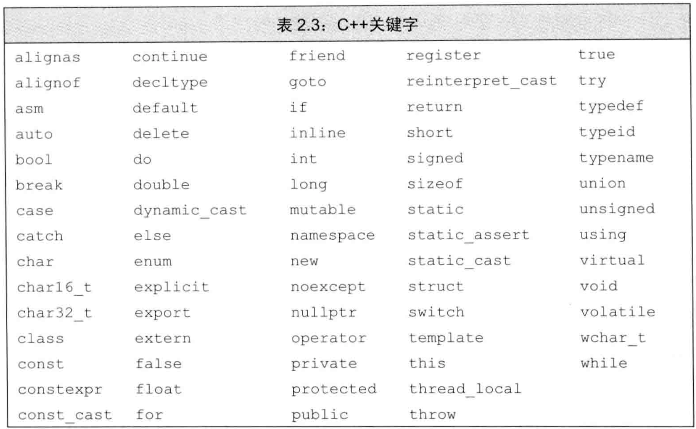
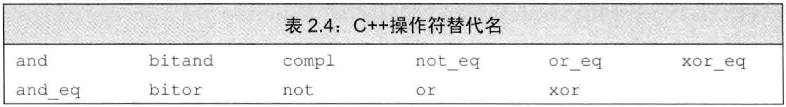

# C++ primer 第2章 变量和基本类型

## 文章目录

[toc]

-   C++定义了一些`基本内置类型`（字符、整型、浮点等），也提供了`自定义数据类型`的机制，`标准库`还定义了一些复杂的数据类型。
-   数据类型决定了程序中`数据`和`操作`的意义。

## 基本内置类型

-   `基本数据类型`：包括`算术类型`和`空类型`，其中`算术类型`包含`字符`、`整型`、`布尔`、`浮点`，而`空类型`不对应具体值。

### 算术类型

-   `算术类型`分为两大类：`整型`（包括字符和布尔）和`浮点`。

-   C++标准只规定类型尺寸的`最小尺寸`，允许编译器赋予更大尺寸（在CSAPP第二章有x86和x64的各类型尺寸）。最小尺寸如表2.1： 

-   `布尔`类型的取值是`true`或`false`。bool类型虽然信息上只有一个bit，但由于`现代计算机的最小寻址单元是byte`，故bool型在这些机器上占8个bit的空间。

-   `char`的大小和机器字节一样

-   除char外的其他字符类型用于扩展字符集，`wchar_t`用于确保可存放机器最大扩展字符集中的任意字符，`char16_t`和`char32_t`为Unicode字符集服务。

-   int至少和short一样大，long至少和int一样大，long long至少和long一样大

-   可寻址的最小内存块称为`字节byte`，存储的基本单元称为`字word`。大多数机器的字节由8bit构成，而字节由4字节（32bit）或8字节（64bit）构成。

-   `类型`决定了数据所占的bit数以及如何解释这些bit的内容

-   `浮点型`可表示单精度、双精度、扩展精度

-   除去bool和扩展的字符类型外，其他整型和浮点型都可分为`signed`和`unsigned`两种

-   未规定默认的char是signed还是unsigned，但其他整型默认是signed

-   未规定signed如何表示，但说明正负数量应该平衡。例如8bit的signed char在现代计算机上一般表示[-128,127]

-   选择数值类型的`最佳实践`：
    -   数值不可能为负时用unsigned
    -   整型运算一般用int，超过int用long long
    -   算术表达式中不要用char或bool，用char应明确指出signed或unsigned
    -   浮点运算用double，因为float精度不够，且float和double计算代价相差不大，而long double计算代价较大

### 类型转换

-   `自动类型转换`：我们使用一种类型而对象实际上应取另一种类型时发生，类型能表示的值的范围决定了转换的过程：
    -   非bool转bool：初始值为0则转为false，初始值为其他值则转为true
    -   bool转非bool：初始值为false则转为0，初始值为true则转为1
    -   浮点转整型：仅保留小数点之前的部分
    -   整型转浮点：小数部分是0，若整型数超过浮点容量，有精度损失
    -   给unsigned赋超出范围的值：初始值对该unsigned类型最大值取模
    -   给signed赋超出范围的值：未定义（在CSAPP第二章有讲运算的上溢和下溢）
-   算术表达式中同时有signed和unsigned，会将`signed自动转为unsigned`

### 字面值常量

-   字面值常量的`类型`由`形式`和`值`决定
-   `进制`：以0开头的整数是八进制，0x或0X开头的是十六进制
-   默认十进制字面值是signed，八进制和十六进制字面值可能是signed或unsigned
-   十进制字面值的类型是int、long、long long中的最小者，八进制和十六进制字面值的类型是int、long、long long、unsigned int、unsigned long、unsigned long long中的最小者。因此`short`没有对应的字面值。
-   `浮点型字面值`表现为小数或以科学计数法表示的指数，默认浮点字面值是`double类型`
-   由单引号括起来的一个字符是`char型字面值`，由双引号括起来的零个或多个字符是`字符串型字面值`
-   字符串型字面值的类型实际是`常量字符`构成的`数组`。编译器在字符串结尾处添加空字符`'0'`，因此字符串的长度比内容多1
-   `字符串分段书写`：如果两个字符串字面值位置紧邻，且仅由空格、缩进、换行符分隔，则实际上是一个整体。
-   `转义序列`：在C++中有特殊含义的字符（如单双引号、问号、反斜线等）出现在字符串中时要转义，另外一些特殊字符（如缩进、换行等）也以转义序列书写
-   `泛化的转义序列`：形式是`\x`后紧跟1个或多个十六进制数，或`\`后紧跟1、2、3个八进制数，其中数字部分表示的是字符对应的数值。如果超过3个，八进制只看前3个，十六进制看所有数字
-   超过8bit的十六进制字符是与表2.2中某个前缀作为开头的扩展字符集一起使用
-   表2.2中的前缀用于指定字符集，后缀用于指定字面值类型 
-   例子：字面值常量
```cpp
L'a'     //宽字符型字面值，类型是wchar_t
u8"hi!"  //utf-8字符串字面值（utf-8用8bit编码一个unicode字符）
42ULL    //无符号整型字面值，类型是unsigned long long
1E-3F    //单精度浮点字面值，类型是float
3.14159L //扩展精度浮点字面值，类型是long double
```

-   bool类型字面值是`true`和`false`
-   指针字面值是`nullptr`（亦可用`NULL`或`0`）

## 变量

-   对cpp程序员来说，`变量`和`对象`一般可以互换使用

### 变量定义

-   `定义`的基本形式：`类型说明符`后紧跟一个或多个`变量名`组成的列表，变量名由逗号分隔。（这是naive的理解，在`复合类型的声明`中有正经理解）
-   `对象`：一块能存储数据并具有某种类型的内存空间
-   `初始化`和`赋值`是完全不同的两个操作。`初始化`是指创建对象时赋予初始值，`赋值`是指把对象的当前值擦除，用新值替代。
-   同一条定义语句中，可用前面的变量初始化后面的变量
-   `列表初始化`：由花括号做初值。
-   如果列表初始化的初始值存在丢失信息的风险，编译器会报错
-   例子：初始化变量
```cpp
int a=0;
int a={0};
int a{0};
int a(0);
```
-   `默认初始化`：定义变量时未指定初值，则是默认初始化，此时变量被赋予“默认值”。
-   内置类型的默认初始化由定义的位置决定：定义于任何函数外的变量被初始化为0，定义于函数体内的内置类型`不被初始化`（attention！所以`建议初始化每一个内置类型变量`）
-   类类型对象的默认初始化由类自己决定

### 变量声明和定义的关系

-   `分离式编译`：将程序分割为若干个文件，每个文件可被独立编译
-   C++将`声明`和`定义`区分开：`声明`使名字为程序所知，`定义`负责创建与名字相关联的实体。
-   `声明`规定了对象的类型和名字，这一点与定义相同。但除此之外，`定义`还申请存储空间，也可能赋予初值。
-   变量能且只能被定义一次，但可以被多次声明。
-   任何包含显式初始化的声明都成为定义。
-   `extern`：若只想声明而不定义，就使用关键字extern，且不要显式初始化。可以给extern显式初始化，一旦这样做，就成了定义。
-   如果在函数体内初始化extern变量，就错误。
-   `多个文件使用同一变量`：用extren将声明和定义分离，定义必须出现且只能出现在一个文件中，其他文件内应声明但不可定义。
-   `静态类型语言`：在编译期检查类型

### 标识符

-   `标识符`：由字母、数字、下划线组成，且必须以字母或下划线开头。长度没有限制，但大小写敏感。
-   C++为标准库保留了命名。用户自定义标识符中：
    -   不能连续出现两个下划线
    -   不能以下划线紧接大写字母开头
    -   定义在函数体外的标识符不能以下划线开头
-   表2.3和2.4是C++保留的名字： [](https://canpi.cc/post/cpp/cpp_figs/CPPprimer_ch2-tab_2_3.png) [](https://canpi.cc/post/cpp/cpp_figs/CPPprimer_ch2-tab_2_4.png)

### 名字的作用域

-   `作用域`是程序的一部分，以花括号分隔
-   同一个名字在不同作用域中可能指向不同实体，名字的`有效区域`始于声明语句，结束于声明语句所在作用域的末端。
-   `全局作用域`是定义在所有函数之外的名字的作用域，`块作用域`是花括号内部的作用域。
-   作用域可彼此包含，称为`外层作用域`和`内层作用域`。允许在内层作用域中重新定义外层作用域已有的名字。
-   用`域操作符::`手动指定作用域，左侧是作用域的名称，全局作用域的名称为空。

## 复合类型

-   `复合类型`：基于其他类型而定义的类型，包括`引用`和`指针`等。
-   `声明`：一条声明语句由一个`基本数据类型`和紧随其后的一个`声名符`列表组成，每个声名符命名了一个变量并指定该变量为与基本数据类型有关的某种类型。

### 引用

-   使用术语`引用`时，通常是指`左值引用`（C++11中新值`右值引用`）
-   `引用`为对象起了另外一个名字。将声名符写为`&d`来定义变量`d`为引用。
-   初始化变量和定义引用的区别：初始化变量时，初始值会被`拷贝`到新建的对象中间；定义引用时，只是将引用和它的初始值对象`绑定`到一起，不发生拷贝。
-   例子：定义引用
```c++
int i=1024, i2=2048;
int &r=i, r2=i2; //r是绑定到i的引用，未发生拷贝。r2是int型对象，发生了拷贝。
```
-   一旦引用被绑定到一个初始值对象，就不可重新绑定到另一个对象。因此`引用必须初始化`。
-   `引用不是对象`，只是为已有对象起的别名，所以不能定义引用的引用。
-   引用只能绑定到已有对象，不能绑定到字面值或表达式的计算结果。
-   引用类型要与其被绑定的对象类型严格匹配。两个例外：常量引用可绑定到非常量对象，基类引用可绑定到派生类对象。

### 指针

-   `指针`是“指向”另一种类型的复合类型。将声名符写为`*d`来声明变量`d`为指针。
-   指针本身是对象
-   指针存放对象的地址。要获取对象的地址，要对此对象使用`取地址符&`
-   例子：定义指针
```cpp
int ival=42;
int *p=&ival; //声名符是*p，变量名是p，对val取地址并用地址&val初始化变量p
```
-   `指针和引用区别`：
    -   指针本身是对象，允许对指针赋值或拷贝，引用不是对象
    -   指针存放对象的地址，引用只是对象的别名
    -   指针可更改指向的对象，引用不可
    -   指针在定义时不需赋初值，引用需要

-   指针状态：

    -   指向一个对象
    -   指向紧邻对象空间的下一个地址
    -   空指针，不指向任何对象
    -   无效指针

-   指针指向一个对象，则允许用`解引用符*`来访问该对象，即可读可写。

-   对无效指针的解引用不会报错，因此必须保证指针的有效性。

-   `空指针`不指向任何对象。

-   得到空指针的方法：

    -   初始化为字面值`nullptr`，C++11引入
    -   初始化为字面值0
    -   初始化为`预处理变量``NULL`，该变量在头文件`cstdlib`中定义，值为0

-   用到`预处理变量`时，预处理器自动将其替换为实际值。因此用NULL初始化指针和用0初始化指针是一样的。

-   尽量用nullptr，避免用0或NULL

-   虽然指针是地址，但不能把int型变量直接赋给指针，int型的0也不行

-   最佳实践：尽量在定义对象之后再定义指针。如果实在不清楚指针指向何处，就初始化为nullptr

-   给指针赋值就是让它存放一个新的地址，即指向一个新的对象

-   例子：指针赋值
```cpp
int ival=42;
int *p=&ival, *pi=nullptr;
pi=&ival;   //指针的地址被改变，即所指对象发生改变
*pi=0;      //指针所指对象的值发生改变
```
-   指针可运算，可bool，可判断相等：
    -   可将指针变量加上或减去整型数
    -   任何非0/nullptr指针的指针都对应条件值true
    -   两个指针存放的地址相等，则指针相等。但一个指针指向某对象，另一个指针指向此对象的下一个地址，也可能两指针相等
-   `void *`是一种特殊的指针类型，可存放任意对象的地址，不管其类型
-   void *指针指向的内存空间只是内存空间，不是对象，除非`类型转换`为特定类型的指针。
-   void *指针不能用于访问对象，只能：
    -   与其他指针比较大小
    -   作为函数的输入输出传递
    -   赋值给另一个void *指针

### 理解复合类型的声明

-   同一条声明语句中，基本数据类型只有一个，但声名符形式可以不同，即可定义多种不同的复合类型
-   声名符中的修饰符（`&`和`*`）的数量没有限制，即可定义指向指针的指针、绑定到指针的引用等
-   例子：指向指针的指针
```cpp
int ival=1024;
int *pi=&ival; //pi指向int型数
int **ppi=&pi; //ppi指向指针pi
```
-   例子：绑定到指针的引用
```cpp
int i=42;
int *p;     //指针可不用初始化
int *&r=p;  //绑定到指针p的引用。
            //r是一个引用，引用的对象是指针，该指针是int型，该引用r被绑定到对象p。
r=&i;       //给r赋值就是给指针p赋值
*r=0;       //解引用r就是解引用指针p
```
-   要理解一个声明，最好的方法是从变量名开始，从右向左（即从内向外）读，例如上例第3-4行“r是一个引用，引用的对象是指针，该指针是int型，该引用r被绑定到对象p”

## const限定符

-   `const关键字`：使变量的值不能被改变。
-   const对象创建后其值不能改变，故必须初始化。
-   如果用一个对象初始化另一个对象，则它们是不是const都无所谓。右边即使是const也可拷贝其内容
-   `const对象仅在文件内有效`：在编译期将const变量都替换为其值。因为是编译期替换，所以必须在每个文件中都定义。不同文件中的同名const是不同的对象。
-   如果要在`文件间共享const对象`，就必须在声明和定义中都用extern，即将所有该对象都声明为文件外可见。

### 对常量的引用

-   `对常量的引用`：将引用绑定到const对象上。对常量的引用不可修改其绑定的对象。
-   对常量的引用又称`常量引用`。严格来说不存在“常量引用”，因为引用不是对象，不存在“常量”一说。但引用不可重新绑定对象，所有引用其实都是“常量”。
-   初始化常量引用时，只需要初始表达式能`类型转换`为常量引用的类型。而普通引用必须类型严格匹配。原因是：类型不匹配时，编译器定义一个临时量用于类型转换。如果允许非常量引用的类型不匹配，就会产生`中间量`，修改引用时修改的是中间量而不是想要绑定的对象。常量对象不可修改，因此不存在这个问题。如下例：
```cpp
//程序员写的代码
double dval=3.14;
const int &ri=dval;
//编译器产生的代码
double dval=3.14;
const int temp=dval; //定义与引用类型匹配的中间量，类型转换
const int &ri=temp;  //将常量引用绑定到中间量
```
-   可将常量引用绑定到非常量对象。此时对象仍可修改，只是不能被这个引用修改。

### 指针和const

-   由于指针是对象，故存在两种：`指向常量的指针`和`常量指针`
-   `指向常量的指针`：指针不是常量，但指向的对象是常量。即，地址可修改，但不能用这个指针修改对象。
-   `常量指针`：指针是常量，但指向的对象不是常量。即，地址不可修改，但可用此指针修改对象。
-   允许令指向常量的指针指向非常量对象，效果是不能通过此指针修改对象。
-   因为常量指针指向的地址不可变，故`常量指针必须初始化`。
-   例子：定义“常量指针”、“指向常量的指针”、“指向常量的常量指针”
```cpp
//定义“常量指针”
int errNumb=0;
int *const curErr=&errNumb;   //常量指针。curErr是const，是指针，指向int对象
//定义“指向常量的指针”和“指向常量的常量指针”
const double pi=3.14;
const double *cptr=&pi;       //指向常量的指针。cptr是指针，指向const double对象
const double *const pip=&pi;  //指向常量的常量指针。pip是const，是指针，指向const double对象
```
-   可以把常量指针copy给非常量指针，但不能把指向常量的指针copy给指向非常量的指针。

### 顶层const

-   `顶层const`表示指针本身是个常量，`底层const`表示指针所指对象是个常量。
-   `顶层const`可表示任意对象是常量，对任意数据类型（算术类型、类、指针）适用。而`底层const`只与复合类型（指针、引用等）的基本类型部分有关。
-   只有指针等复合类型才存在顶层const和底层const的区别，基本类型的const只有顶层const一种。
-   例子：顶层const和底层const
```cpp
int i=0;
int *const p1=&i;       //指针不可变，顶层const
const int ci=42;        //基本类型的const都是顶层const
const int *p2=&ci;      //指向对象不可变，底层const
const int *const p3=p2; //既是顶层const又是底层const
const int &r=ci;        //引用的const都是底层const
```
-   拷贝时，顶层const没有影响。
-   拷贝时，拷入拷出的对象必须有`相同的底层const资格`，或者必须能`类型转换`。
-   例子：顶层const和底层const的拷贝
```cpp
/*接着上一个例子*/
//顶层const不受影响
i=ci;             //ci是顶层const，可拷贝给顶层非const的i
p2=p3;            //底层指向对象的类型严格匹配，可将顶层const的p3拷贝给顶层非const的p2
//底层const的限制
int *p=p3;        //错，p3是底层const，而p底层非const。`不可将底层const拷贝给底层非const`。
p2=p3;            //p2和p3底层指向对象的类型严格匹配，都是底层const。
p2=&i;            //i是int，p2是底层const，`可将底层非const拷贝给底层const`（类型转换）。
int &r=ci;        //错，ci是const int，不可绑定到底层非const的引用。
const int &r2=i;  //i是int，可类型转换为const后绑定到底层const的引用上。
```
-   可把常量指针copy给非const指针（上例`p2=p3;`），常量指针是指针的权限，和对象无关。
-   不可把指向const对象的指针拷贝给指向非const对象的指针（上例`int *p=p3;`），但反之可以（上例`p2=&i;`）。原因是非const对象可类型转换为const对象。

### constexpr和常量表达式

-   `常量表达式`：指不会改变，且在编译期就能得到结果的表达式（两个条件缺一不可）。用常量表达式初始化的const对象也是常量表达式。
-   `constexpr类型`：将变量声明为constexpr类型，就可由编译器来验证变量是否是常量表达式。
-   允许定义`constexpr函数`用于初始化constexpr变量，这种函数应该足够简单，编译期就能得到结果。
-   只能用`字面值类型`来初始化常量表达式，这种类型比较简单，值显而易见，容易得到。算术类型、引用、指针都是字面值类型，自定义类、标准库中的类不是字面值类型。
-   `constexpr指针`的初始值必须是nullptr或0，或指向存储于固定地址（即编译期就确定地址）中的对象。
-   函数体内定义的变量没有固定地址，故constexpr不能指向它们。而定义于所有函数之外的对象其地址固定不变，可用constexpr指针指向它们。另外，允许在函数中手动定义`局部静态对象`，它们也可以有固定地址。
-   constexpr声明中如果定义了复合类型，则constexpr可越过声名符中的复合类型标志，直接对变量名起作用（attention！）。即，constexpr将其定义的对象置为顶层const。

## 处理类型

### 类型别名

-   `类型别名`是一个名字，它是某种类型的同义词。类型别名和类型的名字等价
-   定义类型别名：
    -   用`typedef`关键字
    -   用`别名声明`，即`using`关键字
-   例子：定义类型别名
```cpp
typedef double wages;   //wages是double的同义词
typedef wages base *p;  //base是double的同义词，p是double *的同义词
using SI=Sales_item;    //SI是Sales_item的同义词
```
-   使用typedef时，typedef和其后紧跟的类型是一个整体，即typedef作为声明语句中的基本数据类型的一部分出现。
-   例子：类型别名是复合类型，不能直接替换
```cpp
typedef char *pstring;  //pstring类型是指向char的指针
const pstring cstr=0;   //cstr是const pstring类型，即是常量指针，指向char，
                        //这一句不能理解为“const char *cstr=0”，
                        //后者是指向const char的指针
const pstring *ps;      //ps是指针，指向的对象是“指向char的常量指针”
```
-   若某个类型别名是复合类型，可能会产生意想不到的后果。解读声明时不能直接将类型别名直接替换进去，如上例2-4行。

### auto类型说明符

-   `类型说明符auto`：让编译器通过初始值来推算变量的类型。因此auto类型的变量必须初始化。
-   auto可以在一条语句中声明多个变量，但所有变量的初始基本数据类型都必须一样。
-   例子：auto声明多个变量
```cpp
auto i=0, *p=&i;     //正确，i是整型，p是指向整型的指针
auto sz=0, pi=3.14;  //错误，sz是整型，pi是浮点
```
-   编译器推出的auto有时候和初始值不完全一样。
-   `auto会忽略引用`：引用被用作auto的初始值时，真正参与初始化的是绑定对象的值，此时编译器用绑定对象的类型作为auto类型。
-   `auto会忽略顶层const，保留底层const`。
-   例子：auto会忽略引用，忽略顶层const，保留底层const
```cpp
int i=0, &r=i;
auto a=r;   //绑定int型的引用做初值，a是int型
const int ci=i, &cr=ci;
auto b=ci;  //ci是顶层const，忽略。b是int型
auto c=cr;  //cr是ci的引用，忽略。ci是顶层const，忽略。c是int型
auto d=&i;  //i是int，取地址得到指向int的指针。d是指向int的指针
auto e=&ci; //ci是const int，取地址得到指向const int的指针，是底层const不可忽略。e是指向const int的指针
```
-   `使auto保留引用`：声名符中使用`&`
-   `使auto保留顶层const`：在auto前加const 例子：auto保留引用和顶层const
```cpp
/*接上例*/
const auto f=ci;  //手动指定f为顶层const。ci的类型是const int，经过const auto后得到f是const int。
auto &g=ci;       //手动指定g的类型为引用。引用的对象是ci，即g是const int。
auto &h=42;       //错，h是非常量引用。不能为非常量引用绑定字面值，只能绑定对象
const auto &j=42  //j是引用，绑定到const auto类型，即j是常量引用。可为常量引用绑定字面值
```
### decltype类型指示符

-   `decltype`：返回操作数的类型。auto必须初始化，而decltype只需推导类型，不需初始化。
-   `decltype保留引用和顶层const`，这一点和auto不同。因为decltype常用于查看类型，要返回原本类型，auto常用于定义变量，要考虑使用方便。
-   例子：decltype保留引用和顶层const
```cpp
const int ci=0, &cj=ci;
decltype(ci) x=0; //x的类型是const int，顶层const被保留
decltype(cj) y=x; //y的类型是引用，引用对象是const int
decltype(cj) z;   //错，z是引用，必须初始化
```
-   如果decltype内表达式的内容可作为赋值语句的左值，则decltype得到引用类型。
-   如果decltype内表达式的内容是解引用操作，则decltype得到引用类型。（`解引用指针得到的是所指对象的引用`，而不是值）
-   如果decltype内表达式的内容是变量加上一层或多层括号，编译器把它当成一个表达式。变量是可作为左值的特殊表达式，故此时得到引用类型。
-   例子：对表达式求decltype
```cpp
int i=42, *p=&i, &r=i;
decltype(r) a;    //错，r的推导结果是引用，必须初始化
decltype(r+0) b;  //对，r+0的结果是int，故b是未初始化的int
decltype(*p) c;   //错，解引用得到的结果是引用，c是绑定到int的引用，必须初始化
decltype((i)) d;  //错，d是绑定到int的引用，必须初始化
decltype(i) e;    //对，e是未初始化的int
```
## 自定义数据结构

### 定义Sales_data类型

-   `类`以关键字`struct`开始，紧跟`类名`和`类体`（类体可为空），类体后面可以紧跟变量名以定义对象，故最后必有分号
-   类体中定义类的`成员`。每个对象有自己的一份`数据成员`拷贝，修改一个对象的数据成员不影响其他对象。
-   可为数据成员提供`类内初始值`。创建对象时，类内初始值用于初始化数据成员，未初始化的成员执行默认初始化。
-   类内初始值进行数据成员的初始化时，只能用等号或花括号，不能用圆括号（容易和方法混淆？）

### 使用Sales_data类

略

### 编写自己的头文件

-   可在函数体内定义类，但一般不这么做
-   为确保各文件中类的定义一致，`类通常被定义于头文件中`，且类所在头文件的名字应与类名一样
-   头文件中通常包含那些只能被定义一次的实体，如类、const、constexpr等
-   头文件不能被多次包含，因为对象不能被多次定义
-   可用`预处理器`功能中的`头文件保护符`确保头文件被多次包含仍能安全工作。`预处理变量`有已定义和未定义两种状态。`#define`指令将一个名字定义为预处理变量，`#ifdef`判断一个预处理变量是否已定义，`#ifndef`判断一个预处理变量是否未定义。一旦结果为真，就执行后面的直到`#endif`。
-   例子：头文件保护符
```cpp
//当此头文件第一次被包含时，定义预处理变量SALES_DATA_H，并执行该头文件中的“代码们”
//当此头文件再次被包含时，预处理变量SALES_DATA_H已定义，跳过该头文件中的“代码们”
#ifndef SALES_DATA_H
#define SALES_DATA_H
/*
 * 代码
 */
#endif
```
-   预处理变量无视C++语言中关于作用域的规则，都是`全局可见`。所以整个程序中的每个预处理变量必须唯一。通常的做法是根据头文件的名字来命名保护符。另外，一般将预处理变量的名字全部大写。